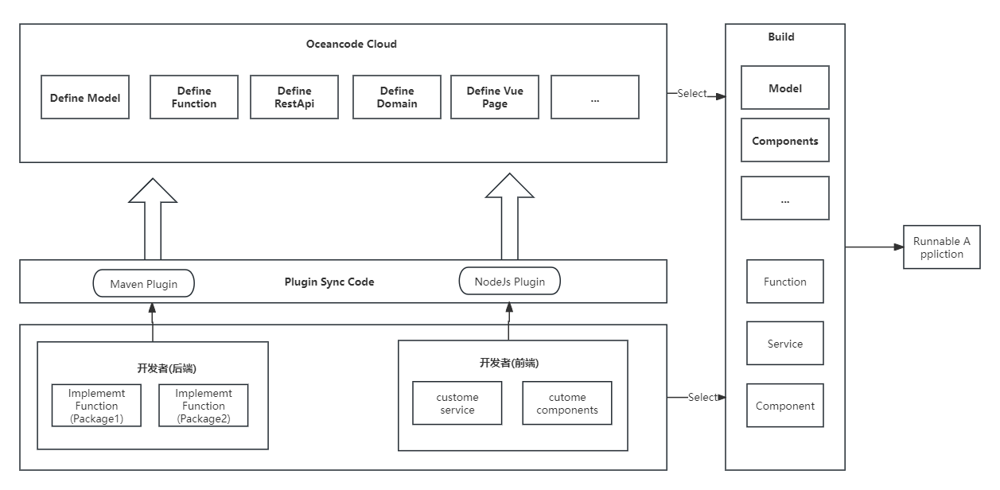

# Oceancode介绍—全端代码生成解决方案

一个专注于全端代码生成的平台，支持后端代码，前端代码，小程序应用，App移动端代码，数据可视化大屏的生成。

## 产品特性
- 后端代码生成：提供后端代码的生成能力。
- 前端代码生成：提供前端管理端代码生成能力，支持表单，表格等常用组件的生成。
- 数据大屏生成：提供数据大屏可视化生成能力，提供在线编辑器的编辑功能，可导出私有部署。
- 框架组件融合：提供对应语言框架的融合能力，实现开箱即用的功能，屏蔽框架版本和差异性。

## 全新开发方式

在Oceancode Cloud中定义Model，Function,Api等。通过对应的插件同步到本地，开发者只需实现定义的函数即可。
构建时只需选择参与构建的应用和定义的组件资源，以及相关的函数实现包即可。`开发者只需参要函数实现。`

> 即整套流程中函数实现是需要开发者编写，其余代码如接口入参校验，返回值，错误码处理，权限控制等均通过生成方式得到。

## 适用场景
- BS端：后端提供Restfull接口，前端做管理端网页版展示。
- 数据大屏：提供数据大屏的快速，低成本可视化。

