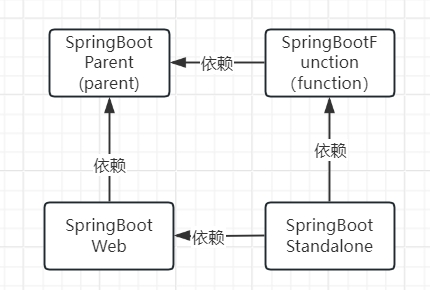

# 应用框架 - SpringBoot 生态

提供SpringBoot 生态代码生成。

# 模块
- SpringBootWeb: SpringBoot Web模块，提供web能能力。
- SpringBoot Parent: parent工程，对所有依赖的版本管理。
- SpringBoot Service: 微服务模块
- SpringBoot Function: 函数模块
- SpringCloud Gateway: 网关模块
- Springboot Standalone: Fat Application 模块，all in one得到一个application.

> 说明：以上模块中只有SpringBoot Function 模块需要用户实现里面的函数，其余模块根据模型等配置自动生成。

# 整体视图结构


> 说明：parent项目时所有项目的父项目，管理依赖版本。function 项目为用户实现的函数，被被service依赖。打包后部署service和gateway网关。




> 说明：Fat Applicaiton 是All in One打包后只需要部署一个应用即可。

# 目录结构
```text
|--parent  Springboot Parent应用生成的代码
|--core  SpringBootWeb 应用生成的代码放于此目录
   |--common 公共模块
   |--util  工具模块
   |--model  模型模块
   |--funciton  函数接口
|--functions 用户实现的函数目录
|--services Springboot Function应用生成的代码放于此目录
```

# 构建
1. core 目录 执行 XX-core中的`build.sh`
2. maven构建 functions
3. maven构建 services
4. maven构建其他项目，如gateway等。

